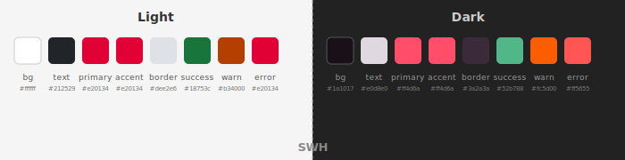
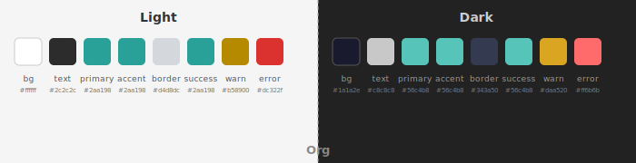
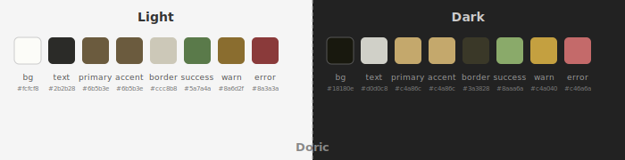
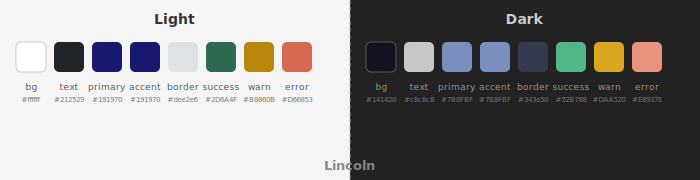
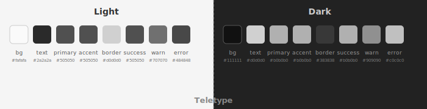
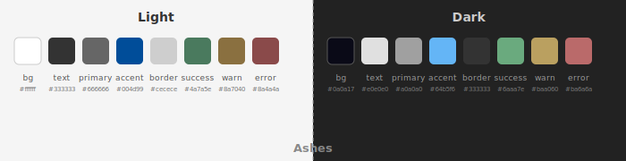

#+title: Pico themes

Shared CSS themes for [[https://codeberg.org/bzg/topics][topics]], [[https://codeberg.org/bzg/bark][BARK]], and [[https://codeberg.org/bzg/hop][hop]].

Six themes are available:

| Theme    | File         | Brand                                       |
|----------+--------------+---------------------------------------------|
| *SWH*      | =swh.css=      | Software Heritage (Red→Orange→Yellow)       |
| *Org*      | =org.css=      | Org-mode / Worg (Teal, indigo dark mode)    |
| *Doric*    | =doric.css=    | Inspired by [[https://protesilaos.com/codelog/2025-05-13-emacs-doric-themes/][Emacs doric-themes]]              |
| *Lincoln*  | =lincoln.css=  | Based on Lincoln blue                       |
| *Teletype* | =teletype.css= | Black & White                               |
| *Ashes*    | =ashes.css=    | Inspired by [[https://bzg.fr][bzg.fr]] (monospace, grey embers) |

* Color palettes

Each theme supports light and dark mode.  Here are the palettes:

** SWH

** Org

** Doric

** Lincoln

** Teletype

** Ashes

BARK-specific overlays live in =bark/= (see below).

* What each theme covers

Each theme file is self-contained and styles:

- *Base elements* --- body, links, headings, tables, code, blockquotes,
  buttons (works with org-parse bare HTML)
- *Pico CSS overrides* --- =--pico-*= variables, cards, details/accordion,
  search, header/footer (topics)
- *org-parse overrides* --- document title, TODO/DONE/priority keywords,
  tags, footnotes, admonitions
- *Dark mode* via =prefers-color-scheme= (automatic) and
  =[data-theme=dark]= attribute
- *Print*, reduced motion, scrollbar styling

* BARK overlays

BARK-specific styles live in =bark/=, one file per theme, each with
chart palette, type badges, buttons, stripe rows:

- =bark/doric.css=
- =bark/org.css=
- =bark/swh.css=
- =bark/lincoln.css=
- =bark/teletype.css=
- =bark/ashes.css=

Each overlay provides =--bark-chart-*= variables (for Vega), type badge
colors (=--bark-mark-*=), status button colors (=--bark-btn-*=), vote
colors (=--bark-vote-*=), =.filters button=, =.theme-toggle=,
=footer.bark-footer=, and stripe row variables.

Load after the base theme:

#+begin_src html
<link rel="stylesheet" href="doric.css">
<link rel="stylesheet" href="bark/doric.css">
#+end_src

* Usage

** Via jsDelivr CDN (recommended)

Once this repo is on GitHub, files are available via jsDelivr:

#+begin_src html
<link rel="stylesheet" href="https://cdn.jsdelivr.net/gh/bzg/themes@latest/doric.css">
#+end_src

Pin to a specific commit for stability:

#+begin_src html
<link rel="stylesheet" href="https://cdn.jsdelivr.net/gh/bzg/themes@COMMIT_SHA/swh.css">
#+end_src

** Per project

*topics* --- set =:theme-url= in config to the CDN URL.

*BARK* --- add two =<link>= tags in =bark-html.clj='s =html-head= function,
after the Pico CDN link:

#+begin_src clojure
(str "<link rel=\"stylesheet\" href=\"" pico-cdn "\">\n"
     "<link rel=\"stylesheet\" href=\"https://cdn.jsdelivr.net/gh/bzg/themes@main/swh.css\">\n"
     "<link rel=\"stylesheet\" href=\"https://cdn.jsdelivr.net/gh/bzg/themes@main/bark/swh.css\">\n")
#+end_src

*org-parse* --- link the theme in the HTML output. Add after the =<style>=
block in =html-template=:

#+begin_src clojure
(str "  <link rel=\"stylesheet\" href=\"https://cdn.jsdelivr.net/gh/bzg/themes@main/org.css\">\n")
#+end_src

The theme =<link>= must come *after* any inline =<style>= block so it
overrides the defaults.

* Dark mode

- *topics*, *org-parse*: automatic via =prefers-color-scheme=
- *BARK*: JS toggle sets =[data-theme=dark]= on =<html>= --- themes respond
  to both selectors

* Contributing

- Send a [[mailto:~bzg/dev@lists.sr.ht][bug report]] with =[BUG] pico-themes: <SHORT EXPLICIT BUG DESCRIPTION>=
- Send a [[mailto:~bzg/dev@lists.sr.ht][patch]] with =[PATCH] pico-themes: <COMMIT SUMMARY>=
- Send a [[mailto:~bzg/dev@lists.sr.ht][feature request]] with =[FR] pico-themes: <FEATURE REQUEST>=
- Share any [[mailto:~bzg/dev@lists.sr.ht][other question or idea]]

You can also [[mailto:bzg@bzg.fr][send me an email]] and support my work on [[https://liberapay.com/bzg/][liberapay]].

* License

CSS files in this repository are published under MPL.
